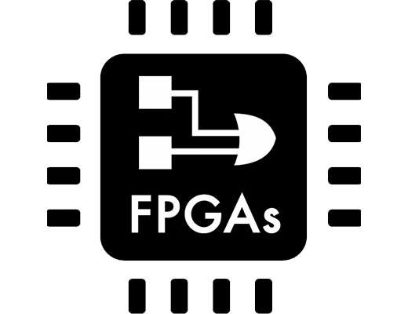
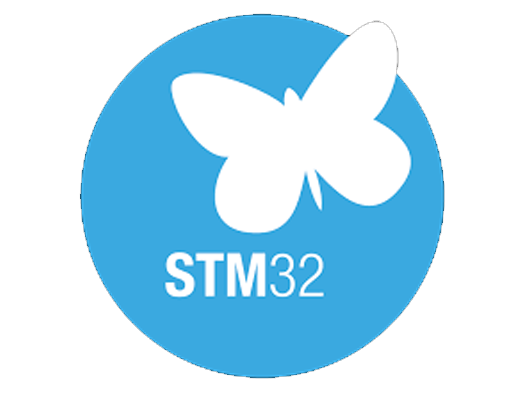
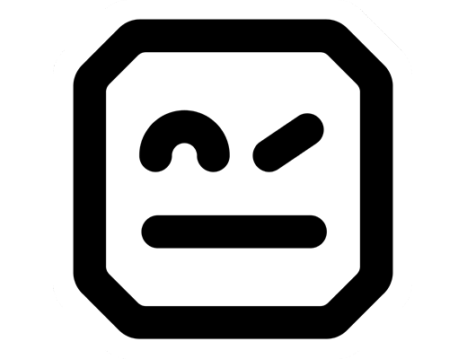

<h2 align="center">SURATAN BOONPONG ✨</h2>

- 🏫 I’m currently studying at King Mongkut's Institute of Technology Ladkrabang (GPA: 3.79)
------------------------------
CONTACT
- 📫 suratan.boonpong@gmail.com
- 🔗 https://www.linkedin.com/in/suratan-boonpong-4766a6254
###

  
  

### :hammer_and_wrench: Language & Tools :

  
  
  
  
  
  
  
  
  
  
  
  
  
  
  
  
  
  
  
  
  
  

###

-----------------------------------------------------------------
 

###
